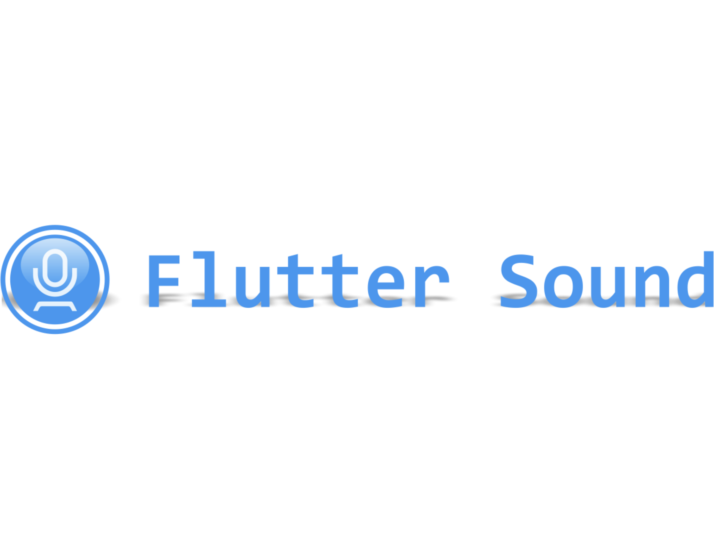

This is the README of /flutter_sound
## Flutter Sound

  
  

-------------------------------------------------------------------------------------

- Flutter Sound user: your [documentation is there](https://canardoux.github.io/tau/book)
- The [CHANGELOG file is here](https://canardoux.github.io/tau/book/CHANGELOG.html)
- The [sources are here](https://github.com/Canardoux/tau)

-----------------------------------------------------------------------------------------------------------------------------------

# Introduction

## Sounds

## Overview

Sounds is a Flutter package allowing you to play and record audio for both the `android` and `ios` platforms.

Sounds provides both a high level API and widgets for:

* play audio
* record audio

Sounds can be used to play a beep from an asset all the way up to implementing a complete media player.

The API is designed so you can use the supplied widgets or roll your own.

The Sounds package supports playback from:

* Assets
* Files
* URL

## Features

The Sounds package includes the following features

* Play audio without any UI
* Play audio using the built in SoundPlayerUI Widget.
* Play audio using the OSs' Media Player
* Roll your own UI utilising the Sounds api.
* Record audio without any UI
* Record audio using the builtin SoundRecorderUI Widget.
* Roll your own Recording UI utilising the Sounds api.
* Support for releasing/resuming resources when the app pauses/resumes.

The core classes are:

| Class | Usage |
| :--- | :--- |
| [SoundPlayerUI](api/soundplayerui.md) | A Flutter Widget Audio Player |
| [SoundRecorderUI](api/soundrecorderui.md) | A Flutter Widget for recording |
| [QuickPlay](api/quickplay.md) | Plays an audio file without a UI. Easiest way to play a beep. |
| [SoundPlayer.noUI](api/soundplayer.md#headless-playback-no-ui) | API to playback audio with fine grained control |
| [SoundPlayer.withShadeUI](api/soundplayer.md#os-shade-using-the-os-media-ui) | API to playback audio using the OS's Shade \(media player\) |
| [SoundRecorder](api/soundrecorder.md) | API to record audio with fine grained control. |
| [Track](api/track.md) | Container for audio used by all of the above classes. |
| [MediaFormat](api/mediaformat.md) | Defines what MediaFormat is being used. |
| [RecorderPlaybackController](api/recorderplaybackcontroller.md) | Flutter InheritedWidget used to co-ordinate Recording and Playback in a single UI. |
| [Albums](api/albums.md) | Play a sequence of Tracks via the OS's Shade \(media player\) |

### Help

Audio is a fundamental building block needed by almost every flutter project.

I'm looking to make Sounds the go to project for Flutter Audio with support for each of the Flutter supported platforms.

Sounds is a large and complex project which requires me to maintain multiple hardware platforms and test environments.

I greatly appreciate any contributions to the project which can be as simple as providing feedback on the API or documentation.

See the [Contributing](contributing/overview.md) section below for details.

#### Sponsorship

If you can't help out by directly contributing code maybe you could Sponsor me so I can spend more time improving Sounds.

Sounds is a large commitment and I'm maintaining several other dart related projects so any support would be greatly appreciated.

Key short term goals are:

* Hire a graphics designer to improve the look of the widgets
* Provide support for the web
* Provide support for a wider range of Codecs
* Provide support for streaming

If I can get enough sponsorship I intend hiring a grad to do a chunk of the dirty work so I can focus on some of the larger features such as Web Support.

You can find the purple heart Sponsor button at the top of the page.

If you can't afford a coffee then show your support by 'liking' the Sounds project on the [pub.dev](https://pub.dev/packages/sounds) site.

## Documentation

[Install](installing.md)

[Manual](https://bsutton.gitbook.io/sounds/)

[API Reference](https://pub.dev/documentation/sounds/latest/)

### Roadmap

See the [Roadmap](roadmap.md) for details on the future of Sounds.

### Contributing

See the [Contributing](contributing/overview.md) guide for details on contributing to Sounds.

The key classes are:

### Api classes

[QuickPlay](api/quickplay.md) - instantly play an audio file \(no ui\). Perfect for the odd beep.

[Track](api/track.md) - Defines a track including the artist details and the audio media.

[Album](api/albums.md) - play a collection of tracks via the OSs' audio UI.

[SoundPlayer](api/soundplayer.md) - provides an API for playing audio including pause/resume/seek.

[SoundRecorder](api/soundrecorder.md) - API for recording audio.

### Widgets

[SoundPlayerUI](api/soundplayerui.md) - displays an HTML 5 style audio controller widget.

[SoundRecorderUI](api/soundrecorderui.md) - displays a recording widget.

[RecorderPlaybackController](api/recorderplaybackcontroller.md) - pairs a SoundPlayerUI and SoundRecorderUI to provide a coordinated recording/playback UI.

Note: there are some limitations on the supported [MediaFormat](api/mediaformat.md).

-----------

This plugin provides simple recorder and player functionalities for
- Android
- iOS
- Flutter Web

# Flutter Sound V6.x is OUT

Please refer to the [CHANGELOG.md file](https://canardoux.github.io/tau/book/CHANGELOG.html) to get learn all the great new features. It has especially the following :

## Flutter Web support

Flutter Sound is supported by Flutter Web. You can play with [this live demo on the web](https://canardoux.github.io/tau/doc/flutter_sound/web_example) (still cannot record with Safari or any web browser on iOS). You can [read this](https://canardoux.github.io/tau/book/tau/codec.html#flutter-sound-on-flutter-web).

## Record to Dart Stream

This feature has been requested from many months from many, many, many Flutter Sound users. This open doors to things like feeding a Speech-to-Text engine.

You can refer to the [Getting Started with Record-to-Stream](https://canardoux.github.io/tau/book/tau/codec.html#recording-pcm-16-to-a-dart-stream) notice.

## Playback from a live Dart Stream

This feature has also been requested from many months from many Flutter Sound users.

You can refer to the [Getting Started with Playback-from-Stream](https://canardoux.github.io/tau/book/tau/codec.html#playing-pcm-16-from-a-dart-stream) notice.

------------------------------------------------------------------------------------------------------------------------------------

## Features

- Play and Record sounds or music with various codecs. (See [the supported codecs here](https://canardoux.github.io/tau/book/tau/codec.html#flutter-sound-codecs))
- Play local or remote files specified by their URL.
- Record to a Dart Stream
- Playback from a Dart Stream
- The App playback can be controled from the device lock screen or from an Apple watch

## Supported platforms

Flutter Sound is actually supported by :
- Android
- iOS
- Flutter Web

Maybe, one day, we will be supported by Linux, Macos, and even (why not) Windows. But this is not top of our priorities.

## Changelog

You can find the [changes here](https://canardoux.github.io/tau/book/CHANGELOG.html)

## Documentation

The [documentation is here](https://canardoux.github.io/tau/book/)

## License

Flutter Sound is copyrighted by Dooboolab (2018, 2019, 2020).
Flutter Sound is released under a license with a *copyleft* clause: the LGPL-V3 license. This means that if you modify some of Flutter Sound code you must publish your modifications under the LGPL license too.

## Help Maintenance

My friend Hyo has been maintaining quite many repos these days and he is burning out slowly. If you could help him cheer up, buy him a cup of coffee will make his life really happy and get much energy out of it. As a side effect, we will know that Flutter Sound is important for you, that you appreciate our job and that you can show it with a little money.

